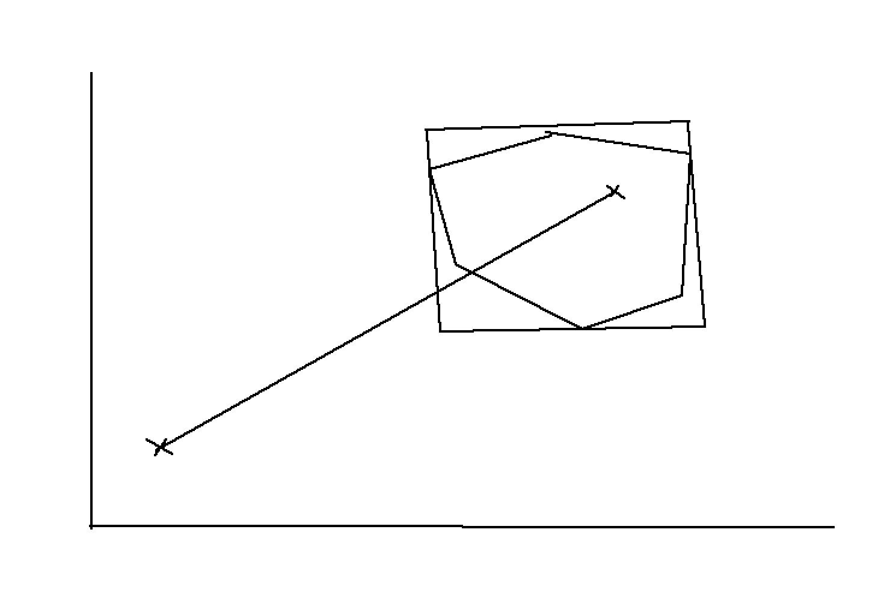

# Get address none api

## Setup

```
1. Go to https://gadm.org/download_country.html => download Shapefile

2. Upload shapefile to this site https://mapshaper.org/

3. Export file json like below image

4. Run file /utils/formatData.js, create bounding box

5. Load resource on code

```


## Idea

```
  1. Muốn biết 1 điểm có nằm trong polygon hay không thì kiểm tra đường thằng từ điểm ngoài (điểm bất kỳ) nối đến điểm cần check. nếu nó cắt polygon với số lẻ thì nó nằm trong polygon

  2. Kiểm tra đường thằng đó có cắt các cạnh polygon hay không bằng phương trình đường thằng y = ax + b

  3. Có thể giảm vòng lặp như sau: kiểm tra các điểm cần check có nằm trong box bao quanh polygon, để giảm giá trị đầu vào
```


