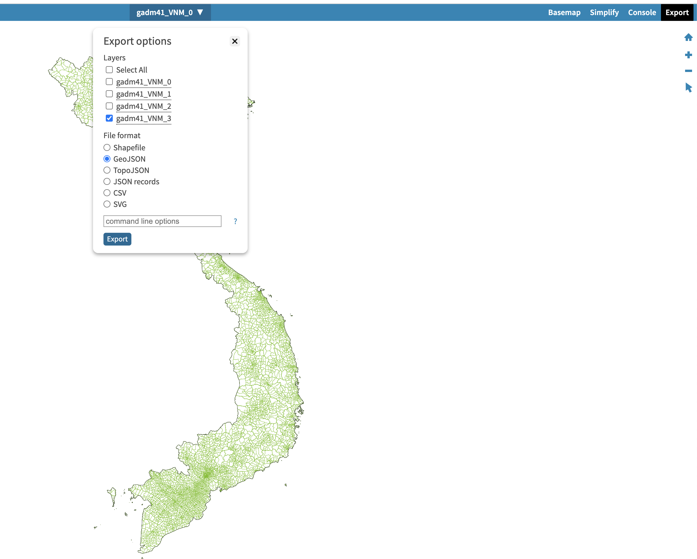

# Get address none api

```
1. Go to https://gadm.org/download_country.html => download Shapefile

2. Upload shapefile to this site https://mapshaper.org/

3. Export file json like below image

4. Load resource on code

```


