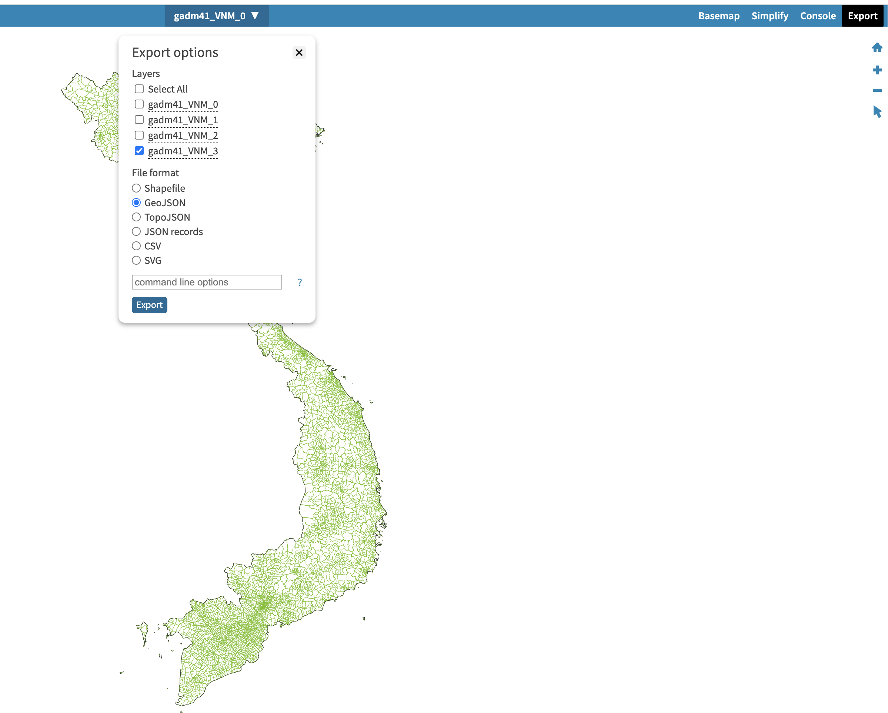
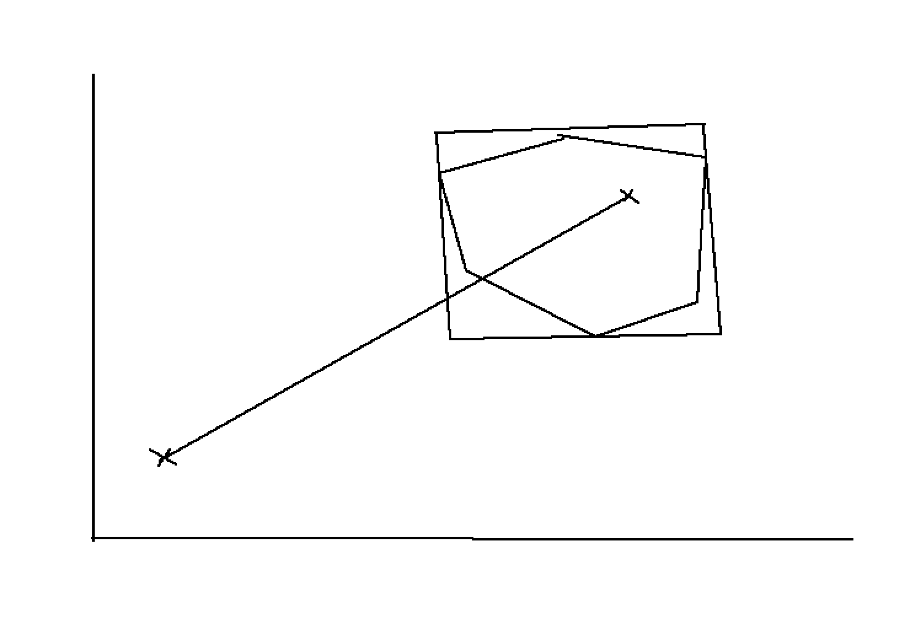

# Get address none api

Tra cứu phường/xã từ toạ độ GPS ngay trên trình duyệt, không gọi API.
Dữ liệu theo đơn vị hành chính **2 cấp** (34 tỉnh/thành - phường/xã/đặc khu).

## Setup

```
1. Tải GeoJSON đơn vị hành chính tại https://gis.vn/don-vi-hanh-chinh-viet-nam
   (hoặc Shapefile từ https://gadm.org/download_country.html rồi export
   sang GeoJSON bằng https://mapshaper.org/)

2. Đặt file vào src/assets/

3. Chạy `npm run gen-data` để sinh src/assets/vietnam-format.json
   (bounding box + đường biên đã được làm đơn giản)

4. `npm run dev`
```

Đường dẫn file nguồn/đích có thể truyền qua tham số:

```bash
npx esno src/utils/formatData.ts <input.geojson> <output.json>
```

Hai biến môi trường điều chỉnh kích thước dữ liệu sinh ra:

| Biến | Mặc định | Ý nghĩa |
| --- | --- | --- |
| `SIMPLIFY_TOLERANCE` | `0.0001` | Sai số làm đơn giản đường biên, đơn vị độ (~11m) |
| `COORD_PRECISION` | `5` | Số chữ số thập phân của toạ độ (~1m) |

Với file nguồn 34 tỉnh (~276MB, 7,28 triệu điểm), mặc định trên cho ra
**3321 phường/xã, ~25MB, giảm 83% số điểm**. Tăng `SIMPLIFY_TOLERANCE` nếu
muốn file nhỏ hơn nữa (đổi lại đường biên kém chính xác hơn).

> File GeoJSON gốc rất lớn nên được bỏ qua trong `.gitignore`; chỉ
> `vietnam-format.json` được commit.

`vietnam-format.json` được `import` thẳng vào bundle nên Rollup cần nhiều RAM,
vì vậy script `build` đã kèm sẵn `NODE_OPTIONS=--max-old-space-size=8192`.
Bundle cuối ~26MB (~7,3MB sau gzip).



## Idea

```
  1. Muốn biết 1 điểm có nằm trong polygon hay không thì bắn 1 tia từ điểm đó ra vô cực.
     Nếu tia cắt các cạnh của polygon với số lẻ lần thì điểm nằm trong polygon (ray casting)

  2. Ở đây dùng tia nằm ngang. Một cạnh cắt tia khi 2 đầu cạnh nằm về 2 phía của tia,
     tức (latI > lat) !== (latJ > lat). Điều kiện này cũng đảm bảo latJ - latI khác 0
     nên công thức tìm hoành độ giao điểm không bao giờ chia cho 0

  3. Có thể giảm vòng lặp như sau: kiểm tra các điểm cần check có nằm trong box bao quanh
     polygon, để giảm giá trị đầu vào. Nhưng bbox chỉ là bộ lọc sơ bộ, vẫn phải kiểm tra
     polygon vì bbox là hình chữ nhật, rộng hơn đường biên thật
```



## Data format

`src/assets/vietnam-format.json` là mảng các đơn vị hành chính:

```jsonc
{
  "code": "09877",           // ma_xa
  "name": "An Khánh",
  "type": "Xã",              // Xã | Phường | Đặc khu
  "provinceCode": "01",
  "province": "Hà Nội",
  "area": 28.69,             // km2
  "population": 102136,
  "bbox": { "minLat": 0, "maxLat": 0, "minLong": 0, "maxLong": 0 },
  "polygons": [[[105.73028, 20.99109]]] // [longitude, latitude]
}
```

## Usage

```ts
import { getAddress, formatAddress } from './utils';

const ward = getAddress(21.0285, 105.8542);
// => { type: 'Phường', name: 'Hoàn Kiếm', province: 'Hà Nội', ... }

formatAddress(ward); // 'Phường Hoàn Kiếm - Hà Nội'
```

`getAddress` trả về `undefined` nếu toạ độ nằm ngoài đất liền Việt Nam.
